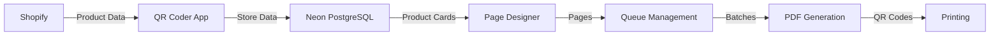

# QR Code Generator for Art Show

A specialized tool for generating QR code PDFs for the Harding Art Show. The tool fetches collection data from Shopify and generates printer-ready PDFs with QR codes that link to artist/vendor collections.

## Features

- **Precision Layout**: Generates QR codes with exact dimensions for pre-perforated paper
- **Production Database**: Direct integration with Neon PostgreSQL for reliable data storage
- **Interactive Dashboard**: Manually create or auto-generate batches of QR codes
- **Page Designer**: Visual editor for creating printable 8.5"×11" pages with 2×5 product card grid
- **Queue Management**: Organize batches for efficient printing
- **Shopify Integration**: Real-time product data from Shopify collections

## Application Architecture

The QR Code Generator uses a straightforward architecture focused on simplicity and reliability. The application uses a Node.js HTTP server with direct connection to Neon PostgreSQL production database. This provides a scalable solution with enterprise-grade database capabilities.

### Data Flow

### Data Model
We maintain three core tables in our Neon PostgreSQL database:
- **Product Cards**: Individual artworks or vendor items (`product_cards` table)
- **Pages**: Collections of 10 cards for printing (`pages` table)
- **Queues**: Batches of pages for processing (`queues` table)

### Processing
- **QR Code Generation**: Using qrcode.js library
- **PDF Creation**: Client-side using jsPDF
- **Batch Processing**: Groups items into printable pages

## Page Dimensions and Printing

The system is designed to work with specific pre-perforated paper dimensions:
- Paper size: Letter (8.5" × 11")
- Grid layout: 2 columns × 5 rows
- Padded area around cells: 1 inch around on top, right, bottom, and left.
- Cell dimensions: 408×211px (Web, 96 DPI) / 1275×660px (Print, 300 DPI)
- Card dimensions: 388×191px (Web)

**IMPORTANT**: The exact dimensions must be maintained for proper alignment with pre-perforated paper.
